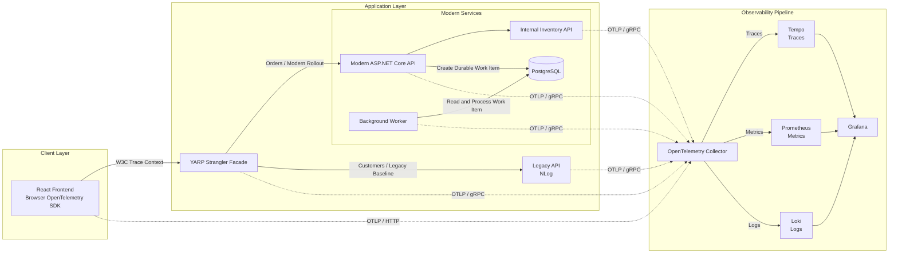

# TelemetryBridge

TelemetryBridge is a vendor-neutral observability integration toolkit for incremental .NET,
legacy NLog, worker, and browser adoption. It includes reusable NuGet/npm packages, a
trace-aware Strangler facade and administration API, PostgreSQL-backed modern/worker samples,
legacy/downstream services, Collector gateway and two-tier tail-sampling modes, optional
Datadog/Azure Monitor routing, and a local Grafana/Tempo/Prometheus/Loki stack.

Application code emits OTLP and contains no Datadog, Azure Monitor, or Grafana SDK calls.
Exporter failure is asynchronous and does not become a business-operation dependency.

## Architecture



See [docs/architecture.md](docs/architecture.md) for the design, trade-offs, repository
structure, and phased roadmap.

## Quick start

Prerequisites:

- Docker Desktop with Compose v2
- 6 GB or more available Docker memory
- Ports `3000`, `3100`, `3200`, `4317`, `4318`, `5173`, `5432`, `8080`–`8084`, and `9090` available

Start the complete local platform:

```powershell
.\scripts\Start-Local.ps1 `
  -AdminKey "replace-with-a-local-admin-key" `
  -OperatorKey "replace-with-a-different-local-operator-key"
```

Then open:

| Surface | URL | Credentials |
|---|---|---|
| Sample frontend | http://localhost:5173 | none |
| Public facade/OpenAPI | http://localhost:8080/openapi/public-api.yaml | none |
| Modern API Swagger | http://localhost:8081/swagger | none |
| Internal / legacy APIs | http://localhost:8082 / http://localhost:8083 | none |
| Admin API | http://localhost:8084 | configured key required |
| Grafana | http://localhost:3000 | `admin` / `admin` (local only) |
| Prometheus | http://localhost:9090 | none |

Click **Create traced order**, open Grafana **Explore**, and select Tempo. The connected trace
crosses browser, facade, modern API, internal API, EF/PostgreSQL, and the durable worker
boundary. Correlated logs go to Loki and metrics to Prometheus. Tempo links traces to Loki.

Stop containers without deleting local volumes:

```powershell
docker compose down
```

Run the scalable trace-ID-balanced tail-sampling mode:

```powershell
docker compose -f docker-compose.yml -f docker-compose.tail-sampling.yml up --build
```

Vendor overlays and their required secret variables are documented in
[docs/vendor-integrations.md](docs/vendor-integrations.md).

## Build and test

```powershell
dotnet build TelemetryBridge.slnx
dotnet test TelemetryBridge.slnx
npm install
npm run build
npm test
docker compose config --quiet
```

Run the live stack trace assertion after Compose is healthy:

```powershell
.\scripts\Test-LiveStack.ps1
```

## Integrate an existing ASP.NET Core application

Reference or package `TelemetryBridge.AspNetCore`, then make two changes:

```csharp
builder.Services.AddTelemetryBridge(builder.Configuration);

var app = builder.Build();
app.UseTelemetryBridge();
```

Configure `TelemetryBridge` in `appsettings.json`, or use standard variables:

```text
OTEL_SERVICE_NAME=orders-api
OTEL_SERVICE_NAMESPACE=commerce
OTEL_SERVICE_VERSION=1.0.0
OTEL_EXPORTER_OTLP_ENDPOINT=https://collector.internal.example:4317
OTEL_EXPORTER_OTLP_PROTOCOL=grpc
OTEL_TRACES_SAMPLER=parentbased_traceidratio
OTEL_TRACES_SAMPLER_ARG=0.1
DEPLOYMENT_ENVIRONMENT=production
```

The application configuration, Collector TLS, authentication, secrets, and backend exporters
remain deployment concerns. See [docs/integration-guide.md](docs/integration-guide.md).

## Package and reuse

Create the reusable artifacts:

```powershell
dotnet pack src/TelemetryBridge.Core -c Release -o artifacts/packages
dotnet pack src/TelemetryBridge.AspNetCore -c Release -o artifacts/packages
dotnet pack src/TelemetryBridge.NLog -c Release -o artifacts/packages
npm pack --workspace @telemetry-bridge/browser --pack-destination artifacts/packages
```

Publish the `.nupkg` files to the organization's authenticated NuGet feed and the `.tgz` to
its npm registry. For a local proof, add `artifacts/packages` as a NuGet source and reference
`TelemetryBridge.AspNetCore` version `0.1.0-preview.1`. Package dependencies pull in
`TelemetryBridge.Core`; add `TelemetryBridge.NLog` only to applications that need it.

Version all packages together, generate them from a tagged build, and promote the exact tested
artifacts between environments. Do not copy source projects into each application.

The current package is explicitly preview-versioned because the official OpenTelemetry EF Core
and process instrumentation packages used by the pinned SDK are still prerelease. Promote it
through your normal internal package qualification before production use.

## Integrate an existing React application

Install `@telemetry-bridge/browser`, initialize it before rendering, and strictly allowlist
origins that may receive trace headers:

```typescript
initializeTelemetry({
  serviceName: "customer-portal",
  serviceVersion: "1.0.0",
  environment: "production",
  otlpEndpoint: "https://telemetry.example.com/v1/traces",
  allowedTraceOrigins: [/^https:\/\/api\.example\.com/],
  samplingRatio: 0.1
});
```

Use `traceAction` only with its stable action names. Request/response bodies, authorization
headers, cookies, query strings, and arbitrary user text are not captured by the package.

## Configuration and sampling

Configuration precedence is standard OpenTelemetry environment variables, explicit registration
callback, `TelemetryBridge` configuration, then secure defaults. Startup validation rejects
missing service identity, invalid endpoints, and invalid sampling ratios.

Development uses 100% sampling in this reference stack. Production configuration demonstrates
10% parent-based ratio sampling; it is an example, not a universal recommendation. See
[docs/sampling-strategy.md](docs/sampling-strategy.md).

## Security warnings

The Compose credentials, unauthenticated OTLP receivers, HTTP transport, debug exporter, and
public local ports are for an isolated workstation only. Never expose this configuration to
the internet. Production requires TLS, authenticated ingestion, network policy, secret-store
injection, dashboard SSO/RBAC, controlled retention, and removal of debug endpoints/exporters.

Telemetry safety is defense in depth: application allowlisting plus Collector deletion rules.
See [docs/security-and-privacy.md](docs/security-and-privacy.md).

## Implementation status

Phases 1–6 and the container-focused portions of Phase 7 are implemented: end-to-end
propagation, worker/message context, EF/Npgsql telemetry, NLog correlation, optional vendor
exporters, head/tail/hybrid sampling, cost estimation, cardinality controls, Strangler rollout
and rollback, OpenAPI contracts, admin authorization/audit/history, dashboards/alerts, and
unit/integration/contract/E2E/load suites.

Kubernetes manifests and Helm packaging are intentionally deferred at the user's request.
Docker Desktop remains the supported deployment for this delivery.

## Known limitations

- `EnsureCreated` is used for local convenience; production requires reviewed EF migrations.
- SQL Server compatibility is documented but the runnable sample uses PostgreSQL.
- Kubernetes/Helm is deferred; production authentication/TLS requires deployment-specific
  certificates, identity provider, and secret-store integration.
- Browser Core Web Vitals and frontend log export remain optional extension points.
- Grafana dashboards assume the pinned OpenTelemetry metric names; confirm names
  after SDK or Collector upgrades.
- Docker image tags are pinned but not digest-pinned.
