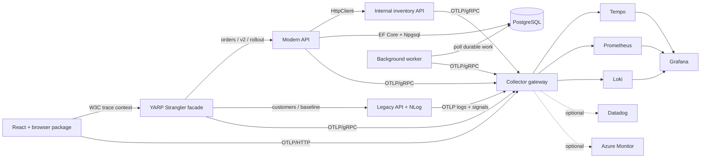
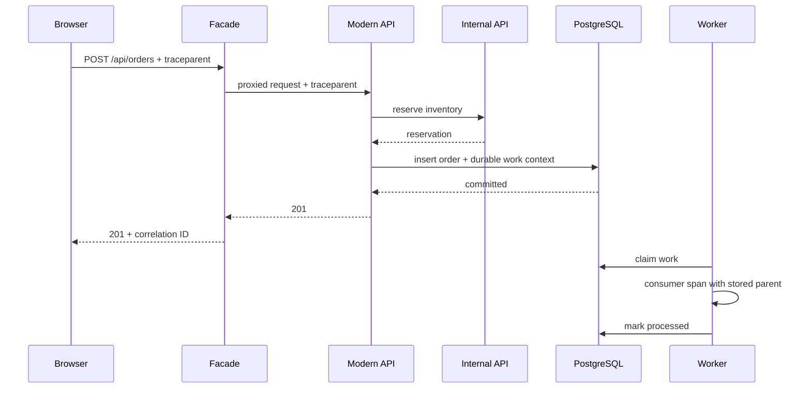
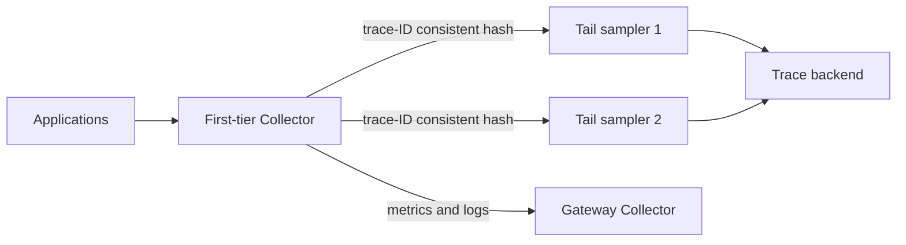
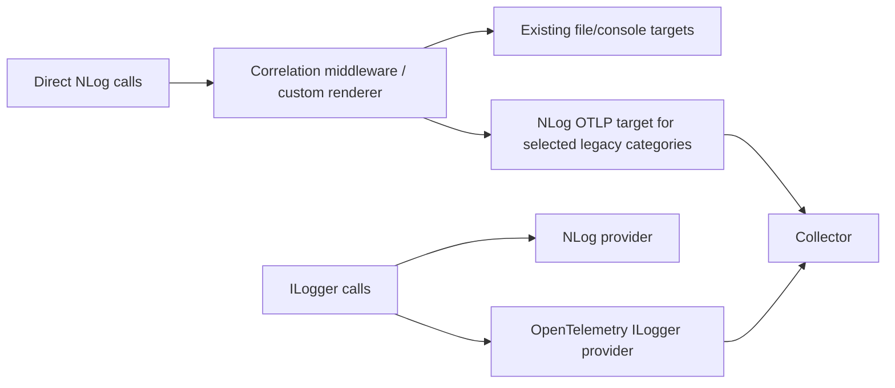
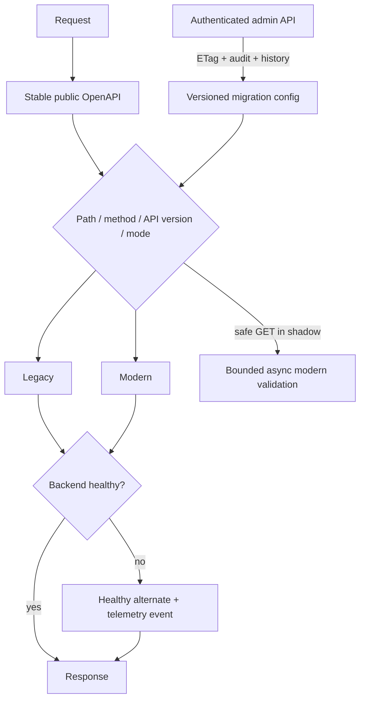
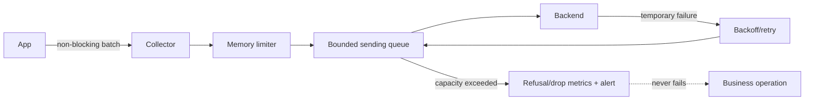

# Architecture and decisions

## Runtime architecture

Business code and reusable packages contain no Datadog, Azure, Grafana, or other proprietary
SDK calls. The Collector owns routing, redaction, retries, queues, and vendor credentials.

## Connected request and worker flow

The durable envelope stores `traceparent`, `tracestate`, and only explicitly allowlisted
baggage. The worker restores the parent for a single-message consumer. `CreateLinks` supports
batch/fan-in work where no single parent is correct.

## Scalable tail sampling

All spans for one trace reach one decision node. Scaling the decision tier changes hash
ownership and can temporarily produce incomplete traces, so capacity changes require a
controlled rollout and a decision-wait drain.

## NLog bridge

Each log category has exactly one OTLP owner. Existing non-OTLP targets remain intact.

## Strangler control flow

## Failure and retry flow

## Key decisions

| Decision | Benefit | Trade-off |
|---|---|---|
| OTLP plus Collector boundary | Vendor-neutral workloads and centralized governance | Collector is production infrastructure |
| Secure allowlist plus Collector deletion | Defense in depth against sensitive/high-cardinality data | Schema changes require review |
| Parent-based head sampling | Immediate predictable volume and upstream consistency | Cannot retain an error already dropped |
| Trace-ID-balanced tail tier | Outcome-aware retention at scale | Stateful memory and operational complexity |
| Durable DB work envelope | Runnable without a broker while proving async propagation | Production high-throughput systems should use an outbox/broker |
| File migration store for Docker | Atomic, inspectable reference implementation | Single-host only; production needs HA configuration |
| Separate Core/AspNetCore/NLog/browser packages | Incremental adoption | Coordinated versioning is required |
| Health-based Strangler fallback | Rollback without client changes | Health alone is not a full compatibility guarantee |

## Repository boundaries

- `TelemetryBridge.Core`: vendor-neutral activities, metrics, policy, propagation, cost model,
  and migration state.
- `TelemetryBridge.AspNetCore`: one-call OpenTelemetry setup, validation, safe database
  defaults, and correlation middleware.
- `TelemetryBridge.NLog`: direct/`ILogger` NLog compatibility and correlation.
- `TelemetryBridge.Browser`: sanitized browser tracing and approved-origin propagation.
- Facade/admin/sample projects: runnable proof and operational workflow, not package internals.
- `collector`, `deployment`, `dashboards`, `load`, and `docs`: infrastructure and operations.

Kubernetes and Helm are intentionally deferred. Container images, Compose, health checks,
non-root .NET runtimes, vendor overlays, tests, and production guidance are included.
