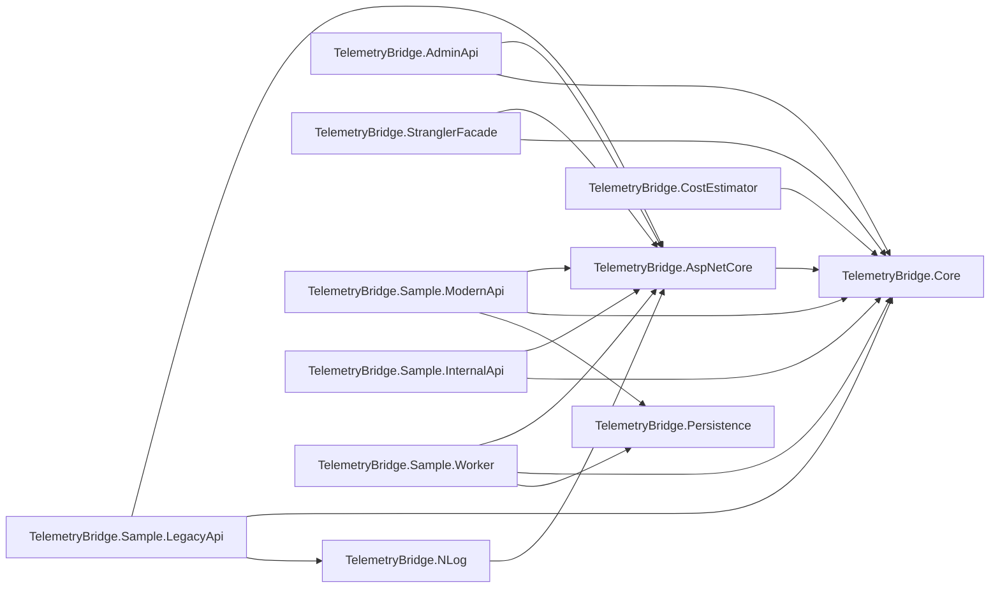

# .NET project guide

The `TelemetryBridge.slnx` solution contains 15 .NET projects: 11 projects under `src` and
4 test projects under `tests`. This guide explains the responsibility of each project, its
important implementation pieces, and how it relates to the rest of the solution.

All projects inherit the repository-wide settings in `Directory.Build.props`. They target
.NET 10, enable nullable reference types and implicit usings, treat warnings as errors, and
build deterministically. NuGet package versions are managed centrally in
`Directory.Packages.props`.

## Project dependency map



Arrows point from a project to another project that it references. The test projects are
described separately below.

## Reusable library projects

### `TelemetryBridge.Core`

Path: `src/TelemetryBridge.Core/TelemetryBridge.Core.csproj`

This is the vendor-neutral foundation of TelemetryBridge. It depends only on the
OpenTelemetry API and can be used without ASP.NET Core or a particular telemetry backend.
It is one of the solution's publishable NuGet packages.

Its main responsibilities are:

- Defining the shared `ActivitySource`, `Meter`, counters, and histograms in
  `TelemetryBridgeDiagnostics`.
- Measuring controlled application operations with `TelemetryOperation`.
- Enforcing allowlists, denylists, value limits, secret removal, and route normalization
  through `TelemetryAttributePolicy`.
- Capturing and restoring W3C trace context across durable message boundaries with
  `TelemetryMessageContext`.
- Representing and atomically storing versioned Strangler migration configuration with
  `MigrationConfigurationStore`, including history, optimistic concurrency, and rollback.
- Estimating trace/log volume, retention, fan-out, and optional ingestion cost with
  `TelemetryCostEstimator`.

Use this package when an application needs TelemetryBridge's custom instrumentation,
propagation, safety policy, migration state, or cost model but does not need the ASP.NET Core
registration helpers.

### `TelemetryBridge.AspNetCore`

Path: `src/TelemetryBridge.AspNetCore/TelemetryBridge.AspNetCore.csproj`

This publishable library is the drop-in integration package for ASP.NET Core applications
and hosted services. It references `TelemetryBridge.Core` and configures the OpenTelemetry
SDK and OTLP exporter.

Its `AddTelemetryBridge` extension:

- Binds and validates the `TelemetryBridge` configuration section.
- Applies standard OpenTelemetry environment-variable overrides.
- Creates service/resource identity attributes.
- Configures tracing for ASP.NET Core, outgoing HTTP, Entity Framework Core, and Npgsql.
- Configures runtime, process, ASP.NET Core, HTTP client, and custom metrics.
- Configures structured .NET logging export over OTLP.
- Applies the selected head sampler and database-statement safety rules.

Its `UseTelemetryBridge` middleware creates a structured logging scope containing trace,
span, request, correlation, service, and environment fields. It also returns a bounded
`X-Correlation-ID` response header.

Most instrumented applications in this repository reference this project and call both
`AddTelemetryBridge` and, for web applications, `UseTelemetryBridge`.

### `TelemetryBridge.NLog`

Path: `src/TelemetryBridge.NLog/TelemetryBridge.NLog.csproj`

This publishable compatibility package helps existing NLog applications participate in
OpenTelemetry traces without immediately replacing their logging implementation. It
references `TelemetryBridge.AspNetCore` and adds NLog-specific packages.

It provides:

- `AddTelemetryBridgeNLog` for registering NLog as a Microsoft logging provider while
  preserving existing NLog targets.
- `UseTelemetryBridgeNLogCorrelation` for adding active trace, request, service, and
  environment values to direct NLog calls made during an HTTP request.
- The `${telemetrybridge-correlation}` layout renderer for reading trace IDs, span IDs,
  trace flags, service name, or environment from the current activity and logging scope.

An application should choose one export path for a logger category. Configuring both the
Microsoft OpenTelemetry logging provider and a direct NLog OTLP target for the same records
would export duplicates.

### `TelemetryBridge.Persistence`

Path: `src/TelemetryBridge.Persistence/TelemetryBridge.Persistence.csproj`

This is a shared Entity Framework Core library for the runnable reference applications. It
is not part of the reusable telemetry package surface.

It contains:

- `TelemetryBridgeDbContext`, with PostgreSQL mappings for orders and work items.
- `Order`, the deliberately non-sensitive sample business record.
- `WorkItem`, a durable work record carrying serialized W3C `traceparent`, `tracestate`,
  and controlled baggage values.
- `DatabaseInitializer`, which creates the local demonstration schema.

The modern API writes orders and pending work items; the worker reads and completes those
work items. `EnsureCreated` and the supplemental SQL are local-demo conveniences. A real
deployment should replace them with reviewed, versioned EF Core migrations.

## Operational and utility projects

### `TelemetryBridge.AdminApi`

Path: `src/TelemetryBridge.AdminApi/TelemetryBridge.AdminApi.csproj`

This ASP.NET Core API manages the versioned migration configuration consumed by the
Strangler facade. It references `TelemetryBridge.AspNetCore` and `TelemetryBridge.Core`.

The API exposes operations to:

- Read the active migration configuration and its ETag/version.
- Update routing mode, modern-payment rollout percentage, and development header routing.
- Read configuration history.
- Roll back to an earlier version.

Requests authenticate through the `X-TelemetryBridge-Admin-Key` header. Operator credentials
can read and update configuration; only admin credentials can roll it back. Updates use an
`If-Match` ETag for optimistic concurrency and produce an audit history through the shared
file-backed store. This implementation is suitable for the containerized reference stack;
a multi-instance production deployment needs shared, highly available state.

### `TelemetryBridge.StranglerFacade`

Path: `src/TelemetryBridge.StranglerFacade/TelemetryBridge.StranglerFacade.csproj`

This is the public YARP reverse-proxy entry point for the Strangler Fig migration example.
It references `TelemetryBridge.AspNetCore` and `TelemetryBridge.Core` and serves the public
OpenAPI document.

For each request it reads migration state, selects the legacy or modern backend, records the
routing decision, and forwards the request. The current rules send orders to the modern API,
customers to the legacy API, and payments according to API version or rollout configuration.
Trace-ID bucketing makes percentage rollout stable within a distributed trace.

The project also:

- Monitors both backends and falls back for operations supported by both when one is
  unhealthy.
- Returns `503` when no compatible healthy backend exists.
- Supports bounded, read-only shadow validation of payment GET requests.
- Emits metrics, activities, and structured logs for routing, fallback, health, and proxy
  failures.

### `TelemetryBridge.CostEstimator`

Path: `src/TelemetryBridge.CostEstimator/TelemetryBridge.CostEstimator.csproj`

This command-line utility wraps the vendor-neutral cost model in `TelemetryBridge.Core`. It
reads one JSON input file and prints a formatted JSON estimate containing daily spans,
trace/log/export volumes, monthly exported volume, retained volume, metric-series count, and
optional vendor and infrastructure costs.

Run the included example with:

```powershell
dotnet run --project src/TelemetryBridge.CostEstimator -- `
  src/TelemetryBridge.CostEstimator/example-input.json
```

The calculator deliberately does not embed vendor prices. See `docs/cost-management.md` for
input assumptions and interpretation.

## Runnable sample projects

### `TelemetryBridge.Sample.ModernApi`

Path: `src/TelemetryBridge.Sample.ModernApi/TelemetryBridge.Sample.ModernApi.csproj`

This is the modern ASP.NET Core implementation behind the facade. It demonstrates the full
telemetry path across HTTP, a downstream service call, Entity Framework Core/PostgreSQL, and
a durable worker boundary.

Its endpoints list, create, and retrieve orders and provide the modern implementation of the
payment routes. Creating an order:

1. Starts a controlled `order.create` operation.
2. Calls the internal inventory API through a resilient instrumented `HttpClient`.
3. Writes the order and a durable work item in one database save.
4. Captures W3C propagation fields on the work item so the worker can continue the trace.

The project also provides Swagger/OpenAPI, CORS for the sample browser, health checks for
PostgreSQL, retrying Npgsql connections, and local schema initialization. It references
`TelemetryBridge.AspNetCore`, `TelemetryBridge.Core`, and `TelemetryBridge.Persistence`.

### `TelemetryBridge.Sample.InternalApi`

Path: `src/TelemetryBridge.Sample.InternalApi/TelemetryBridge.Sample.InternalApi.csproj`

This small downstream ASP.NET Core service proves that trace context propagates over an
outgoing HTTP call. Its inventory-reservation endpoint starts an `inventory.reserve`
operation, simulates a short piece of work, writes a structured log, and returns an accepted
response. It also exposes a health endpoint.

The modern API calls this service while creating an order, so both services appear in the
same distributed trace. It references `TelemetryBridge.AspNetCore` and
`TelemetryBridge.Core`.

### `TelemetryBridge.Sample.LegacyApi`

Path: `src/TelemetryBridge.Sample.LegacyApi/TelemetryBridge.Sample.LegacyApi.csproj`

This ASP.NET Core service represents an existing application that uses direct NLog calls. It
demonstrates incremental instrumentation through `TelemetryBridge.AspNetCore` plus the NLog
correlation middleware.

It owns the legacy customer endpoint and the legacy implementation of payment routes.
Customer requests produce a direct NLog record that carries the current OpenTelemetry trace
and span identifiers. The facade uses this service as the default/fallback implementation for
legacy routes. It references `TelemetryBridge.AspNetCore`, `TelemetryBridge.Core`, and
`TelemetryBridge.NLog`.

### `TelemetryBridge.Sample.Worker`

Path: `src/TelemetryBridge.Sample.Worker/TelemetryBridge.Sample.Worker.csproj`

This .NET Worker Service processes the durable work items created by the modern API. It polls
PostgreSQL for unprocessed items, restores each item's serialized W3C context, and starts a
consumer activity parented to the originating request trace.

For each batch it records the pending count. For each completed item it records an activity,
a structured log, a processed counter, and a completion timestamp. This demonstrates trace
continuity without requiring a message broker. It references `TelemetryBridge.AspNetCore`,
`TelemetryBridge.Core`, and `TelemetryBridge.Persistence`.

## Test projects

### `TelemetryBridge.UnitTests`

Path: `tests/TelemetryBridge.UnitTests/TelemetryBridge.UnitTests.csproj`

This xUnit project checks individual components without running the complete deployment. It
directly references `TelemetryBridge.Core`, `TelemetryBridge.AspNetCore`,
`TelemetryBridge.NLog`, and `TelemetryBridge.StranglerFacade`.

Its tests cover:

- Attribute sanitization, sensitive-field rejection, value bounds, and route normalization.
- Activity creation and operation metrics.
- Sampler creation and configuration validation.
- Trace continuation, baggage allowlisting, and fan-in activity links.
- Cost-estimation calculations.
- Migration-store concurrency and history.
- NLog trace/span rendering.
- Stable facade routes, payment rollout boundaries, and API-version overrides.

### `TelemetryBridge.IntegrationTests`

Path: `tests/TelemetryBridge.IntegrationTests/TelemetryBridge.IntegrationTests.csproj`

This xUnit project hosts `TelemetryBridge.AdminApi` in memory with
`WebApplicationFactory<Program>`. It exercises the real HTTP/authentication/authorization
pipeline and a temporary migration store.

The tests verify that operators can read and update but cannot roll back, admins can roll
back, ETags enforce optimistic concurrency, and stale writes return conflicts.

### `TelemetryBridge.ContractTests`

Path: `tests/TelemetryBridge.ContractTests/TelemetryBridge.ContractTests.csproj`

This xUnit project validates the YAML OpenAPI documents as repository artifacts. It does not
reference an application project.

The tests ensure that every public facade path has a corresponding implementation contract,
that the specifications use OpenAPI 3.1, and that public operations have stable operation
IDs. This detects API-contract drift without starting a service.

### `TelemetryBridge.EndToEndTests`

Path: `tests/TelemetryBridge.EndToEndTests/TelemetryBridge.EndToEndTests.csproj`

This xUnit project validates the running Docker Compose stack rather than isolated classes.
It does not reference the application projects because it interacts with them over their
real network interfaces and queries the observability backends.

The tests create an order through the facade and verify the connected trace across the
facade, modern API, internal API, PostgreSQL, and worker. They also verify that a direct NLog
record from the legacy API is searchable by its trace ID. Run these tests only after the
local stack is healthy.

## Which projects should an application consume?

- Start with `TelemetryBridge.AspNetCore` for an ASP.NET Core application or hosted service;
  it brings in `TelemetryBridge.Core` transitively.
- Reference `TelemetryBridge.Core` directly for framework-neutral custom instrumentation or
  message propagation.
- Add `TelemetryBridge.NLog` only when preserving or migrating an NLog integration.
- Treat the admin API, facade, persistence, cost estimator, samples, and tests as reference
  implementations or operational tools rather than application-facing packages.
